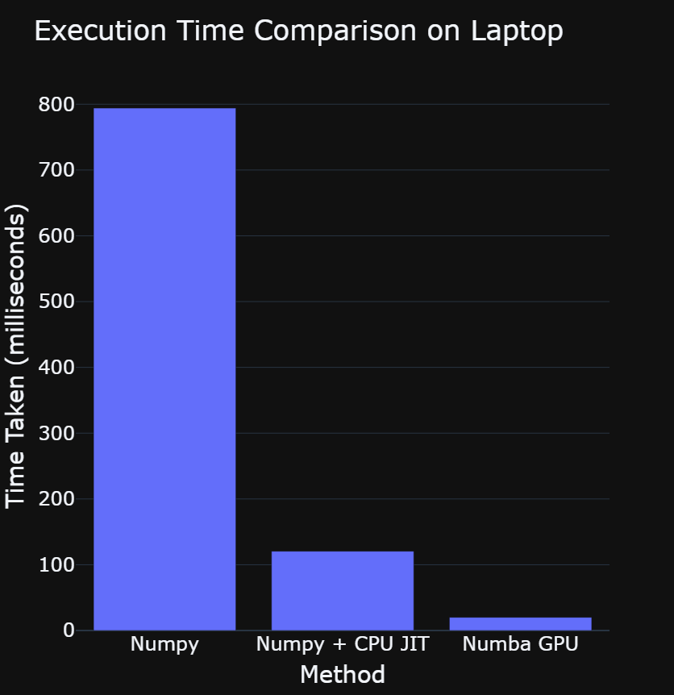
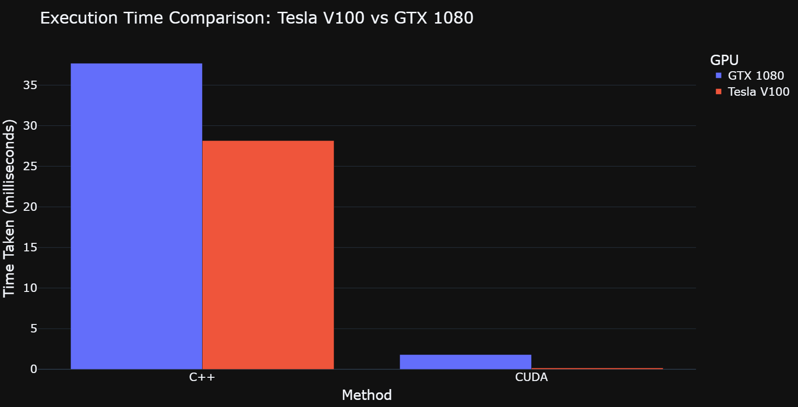

# GPU-Accelerated-KNN
Implemention of the KNearestNeighbors algorithm, accelerated by over **450x** with CUDA C++ and **40x** in Python with Numba. The CUDA implementation parallelizes the sorting of distances using [Bitonic Sort (GPU Gems 2 section 46.4.1)](https://developer.nvidia.com/gpugems/gpugems2/part-vi-simulation-and-numerical-algorithms/chapter-46-improved-gpu-sorting)

This project is used to accelerate computation for another project: https://github.com/khan0617/Music-Recommender.

## Performance Improvements
Laptop Results            |  GPU Desktop Results
:-------------------------:|:-------------------------:
  |  

## Before Starting
CUDA Notes:
- The CUDA/C++ code was tested on machines running Red Hat Enterprise Linux (Maipo release 7.9).
- CUDA Toolkit / NVCC version release 10.1, version V10.1.243.
- You will need to have a machine with an NVIDIA GPU and nvcc installed for the CUDA code to compile.

Python Notes:
- You will need to have `cuda toolkit` installed on your system.
- Recommended setup process is as follows, using [conda](https://www.anaconda.com/). This installs python dependencies as well as the cuda toolkit.
```
conda create -n gpu_knn
conda activate gpu_knn
conda install cuda -c nvidia
pip install -r requirements.txt
```

## Usage
You can use the accelerated KNN implementation via the C++ interface or the python interface.

Be sure to clone this repository or download the zip before starting.

### CUDA C++ KNN interface (`cuda/` directory)
The CUDA code currently runs using the provided `normalized_knn_data.csv` file. To use your own file, be sure to edit the constants in `support.h` to match your dataset:
```
#define NUM_RECORDS 170653  // how many points in the dataset (likely the number of rows in a csv.)
#define NUM_BIOTONIC 262144 // Smallest power of 2 that holds NUM_RECORDS
#define NUM_DATA_FEATURES 9 // how many features each point in dataset has (number of columns in a csv.)
#define NUM_NEIGHBORS 10    // how many nearest neighbors to get
#define MAX_DISTANCE 20
#define DATASET_FILENAME "normalized_knn_data.csv"
```
1. Build the executable: `make`
    - Depending on your system architecture and environment variables, you may need to modify `NVCC_FLAGS` in the `Makefile`.
2. Run the program: `./gpu_knn <query_index>`
    - `query_index` is the row of the dataset which you want to use as the query.
    - Results will be printed to the terminal.

### Python interface (`python/` directory)
1. Install the dependencies (numba, numpy, etc.): `pip install -r requirements.txt`
2. Drop the `gpu_kneighbors.py` into the project you'd like to use it in.
3. Here's how `GpuKNeighbors` might be used, assuming you read data in from a csv:

```
>>> import numpy as np
>>> from gpu_kneighbors import GpuKNeighbors

>>> # data should be a normalized, numerical only numpy array.
>>> X = np.genfromtxt('data.csv', delimiter=',')

>>> # initialize the learner to find the 5 nearest neighbors with the data
>>> gpu_knn = GpuKNeighbors(k=5)
>>> gpu_knn.fit(X)

>>> # get the distances and indices of kneighbors for the last element of X
>>> distances, indices = gpu_knn.predict(X[-1])
```

### Alternative Testing
- Run `test_gpu_knn.py` to try out the GpuKNeighbors. This file just implements the above usage example. Change `query_index` to try out different queries.
